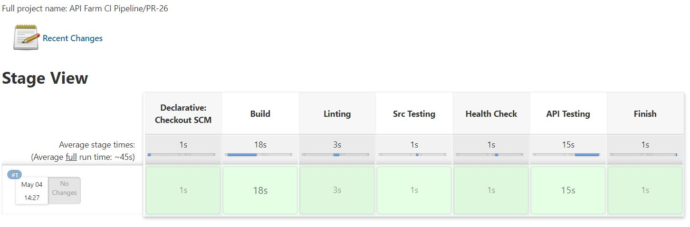
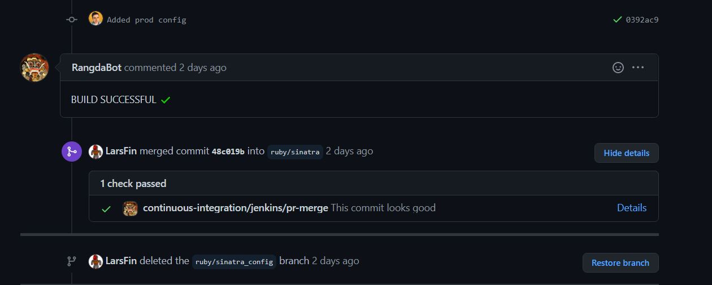

# API Farm

A repository of APIs written in different programming languages and frameworks. Each framework's development has been unit and API tested. Also, documented with instructions for how to start up locally (addtional docker support included too).

## API Use Case

The api developed in each environment should support creation, reading, updating and deletion of a resource. The management of data can vary from in memory, file storage or a database.

Each api should be unit tested with a language supported framework where possible. Also, generic API tests should be run against each working instance of the API. Results from these tests should be collected for comparison.

To allow fair metric comparison from api tests, the api model resource will be standardised across each of the languages and frameworks. The api model resource will be a `video game`. This resource has been structured below in JSON;

```json
{
    "name": "Banjo Kazooie",
    "developers": [
        "Rare"
    ],
    "publishers": [
        "Nintendo"
    ],
    "directors": [
        "Gregg Mayles",
        "George Andreas"
    ],
    "producers": [
        "Tim Stamper",
        "Chris Stamper"
    ],
    "designers": [
        "Gregg Mayles"
    ],
    "programmers": [
        "Chris Sutherland"
    ],
    "artists": [
        "Steve Mayles",
        "John Nash",
        "Kevin Bayliss",
        "Tim Stamper"
    ],
    "composers": [
        "Grant Kirkhope"
    ],
    "platforms": [
        "Nintendo 64"
    ],
    "date_released": "29/06/1998"
}
```

## Languages & Frameworks

Below, the various languages and frameworks are listed which are used within this repository;

| Language | API Framework | Test Framework | Storage Support | Docker Support | Link |
| -------- | ------------- | -------------- | --------------- | :------------: | ---- |
| Ruby     | Sinatra       | Rspec          | In Memory       |       ✔️      | [ruby/sinatra](https://github.com/LarsFin/API-Farm/tree/master/ruby/sinatra)  |

## Project Structure

This repository is designed to clearly silo each of the api samples.

```
api_farm
|___lang-1
|   |___framework-1
|   |___framework-2
|___lang-2
    |___framework-1
```

Each framework will have its own standalone api example within a separate directory.

## Docker 🐳

Most apis can be run and tested using Docker. Additionally, lint checks can also be run against the api's code base too. Scripts exist within `./scripts` to aid in managing api containers and images. Alternatively, you can build the lang/framework Dockerfile yourself.

The guides below use the shell scripts.

### Building an Image

An image for a lang/framework can be build under two environmental contexts;
- **dev:** a heavier image including tools necessary for linting and src code testing.
- **prod:** a light weight image, for compiled languages this may include only the executable.

The `./scripts/build.sh` script takes two arguments. The first instructs which lang/framework to build. The second; under which environment to build the image. For example; wanting to build the `ruby/sinatra` api image for a dev environment you could run the command below.

```shell
./scripts/build.sh ruby/sinatra dev
```

Not providing an environment will result in an image being built for the dev environment by default. It should be noted that this script will overwrite existing built images for the target lang/framework with the environment. As part of this, it will stop and remove any containers using older versions of the image.

### Running an Image

TODO

## CI ⚙️

Jenkins is used to ensure pull requests into lang/framework branches and the master branch are healthy. A multi branch pipeline has been configured within Jenkins to *build, lint, unit test, health check and run api tests* against pull requests. Below, is a screen shot of a successful pull request within Jenkins.



Above, is a pull request which was made into master (`ruby/sinatra` -> `master`). For pull requests into a lang/framework branch (i.e; `ruby/sinatra_post` -> `ruby/sinatra`), all stages above are run except for api tests.

A GitHub user has been created '[RangdaBot](https://github.com/RangdaBot)' to communicate the status of builds within Jenkins for a pull request. Rules have been configured on branches to ensure builds were successful in Jenkins before merging.

Below, is an image of the bot user account in action.



The AWS EC2 instance running Jenkins uses Docker to run its stages. This prevents disk space on the EC2 instance getting cramp from language dependencies.