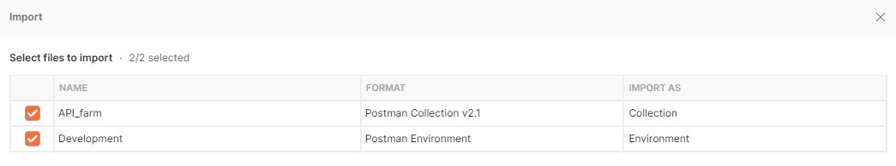
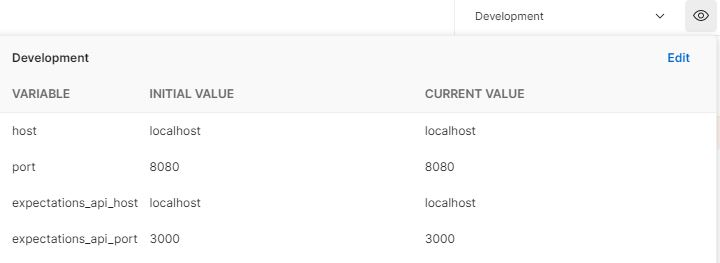
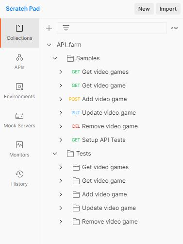
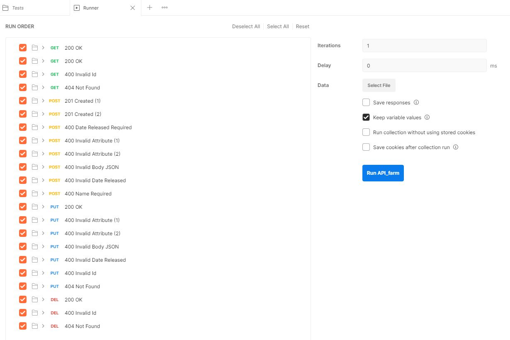
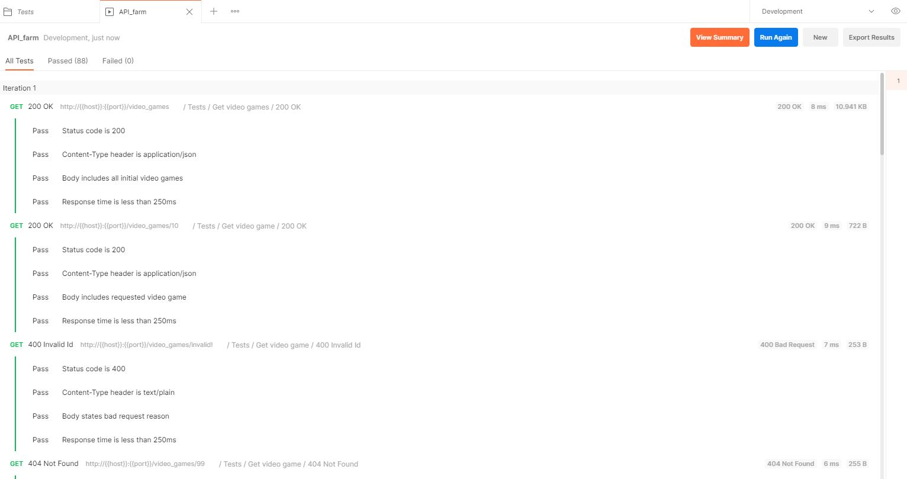
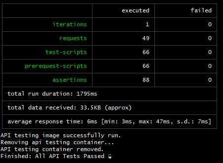

# API Testing

For our api tests, we use Postman to make requests and assert the responses.

## Prerequisites

A few services must be running and accessible before the api tests can be run;

- The target `lang/framework` api must be running and accessible on port 8080 (this is the api you want to test).
- The expectations api must be running and accessible on port 3000.

## Running the API Tests

You can choose to run the api tests with docker or directly within Postman itself.

### Postman

This method uses the development environment as opposed to the Api Testing environment. This is because the Api Testing env uses Docker service names which are used to identify containers on the same network.

1. Download and install Postman (download link [here](https://www.postman.com/downloads/)).
2. Import Development environment and collection. These can be located at `postman/Development.api_farm.json` and `postman/API_farm.postman_collection.json` respectively.



3. Ensure the Development environment is selected within Postman.



4. Check that your workspace includes the Samples & Tests (yours might not look exactly like the image below due to updates made).



5. Highlight the Tests folder and click Run, this will open the Postman Test Runner.



6. Finally, hit `Run API_farm` to fire off the tests. Provided services are available and you're using master, you should have results similar to those below;



### Docker

This method is used for the CI pipeline.

1. Download and install Docker (download link [here](https://www.docker.com/products/docker-desktop))
2. From this directory, run the `run.sh` script. It requires the api container name you wish to run the tests against (e.g; `ruby_sinatra` for ruby/sinatra).

```shell
./run.sh ruby_sinatra
```

3. Results from the tests should be output to the console. As well as a final indication as to whether all the tests passed;



Logs are captured from api tests run using Docker. These can be found within the relative directory `./logs`.
